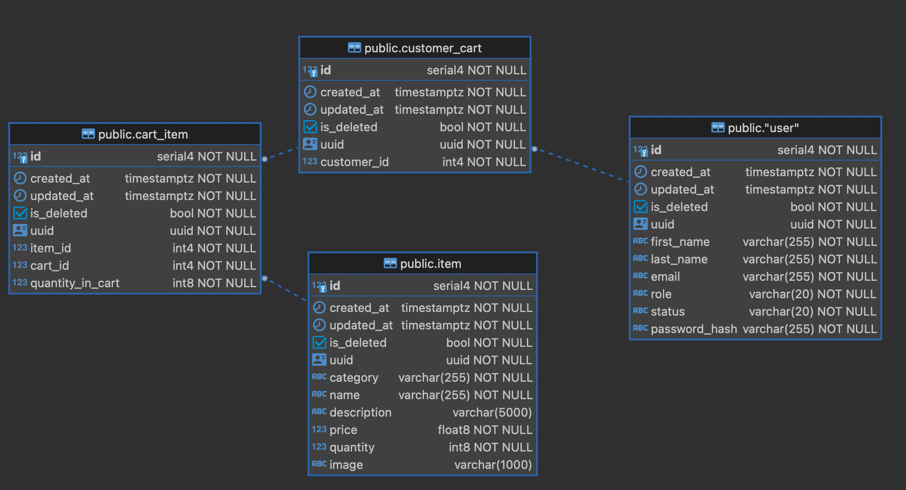

# Cart Application

## Features implemented

1. Ability to create account with two user roles (admin, customer) and log in
2. Admin can add items to the inventory , list items into inventory and suspend a customer user
3. Customer can add items to the cart, list items in the cart , list available items in inventory , remove items from
   cart
4. RBAC is implemented for admin and customer users
5. JWT token based authentication is implemented for all the APIs

## Low level design



1. User is a generic entity which can be either admin or customer
2. item is an item which can be added to the inventory , customer can add these items into cart. This is also
   alternatively referred as original_item in the codebase.
3. customer_cart is a cart which is created for a customer user. It has one to one relationship with user and one to
   many relationship with cart_item.
4. cart_item is an item which is added to the customer cart. It has many to many relationship with original_item and
   many to one relationship with customer_cart. cart_item has a field called quantity_in_cart which represents the
   quantity of the original_item in the cart.

## Running the application

Complete application is dockerized and docker-compose can be used to run the application.
Environment variables can be configured in config/.env file. config/env.sample provided for reference.
TO simply run the application with default config, you can run the following command

```bash
cd docker && docker compose up
```

## Running the tests
unit tests are also dockerized and can be run using the following command
```bash
cd docker_test && docker compose up
```

## API Documentation

1. swagger documentation is available at [swagger docs](http://localhost:9999/docs) when you run the application.
2. postman documentation with example requests(success, failure , validation , etc) is also provided
   at [postman docs](https://documenter.getpostman.com/view/15455073/2s93XsXmE8)

## Improvements

1. admin and customer can be normalized into separate table and user can be a generic entity which can be either admin
   or customer.
2. signup api can be made more secure right now it is open api and anyone can signup as admin or customer.
3. logout api can be implemented to invalidate the jwt token.
4. redis to improve the performance of the application.